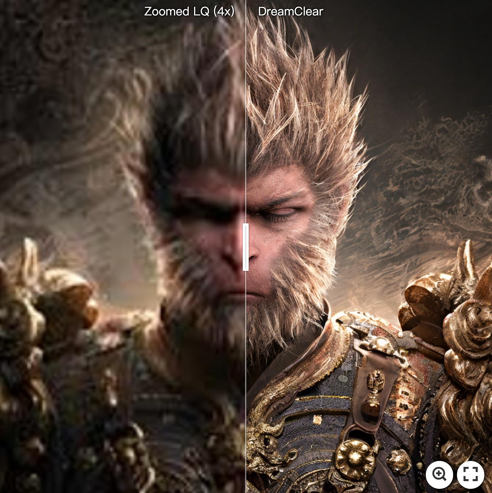
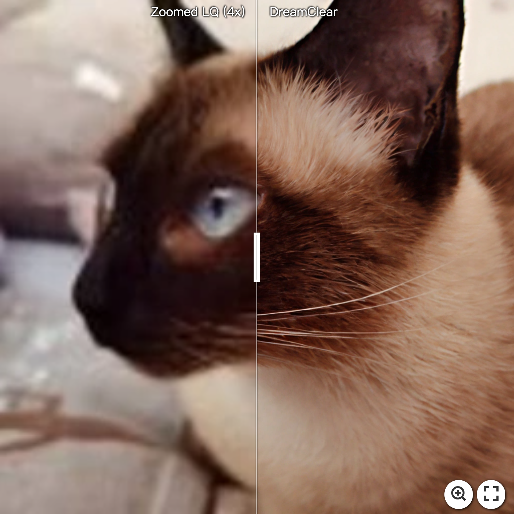
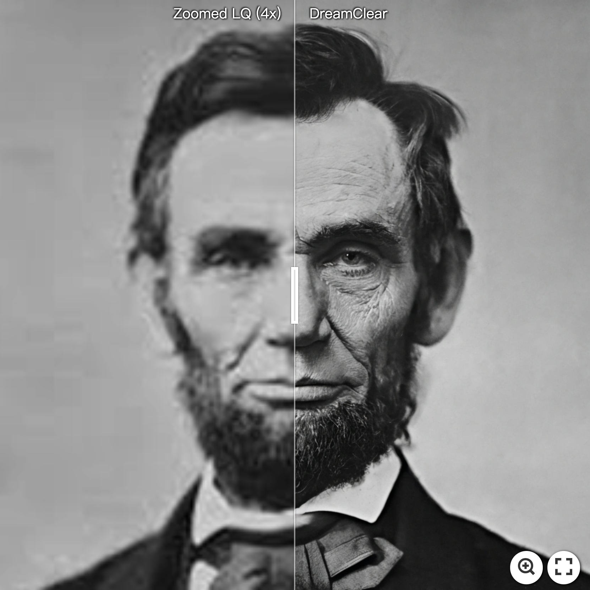
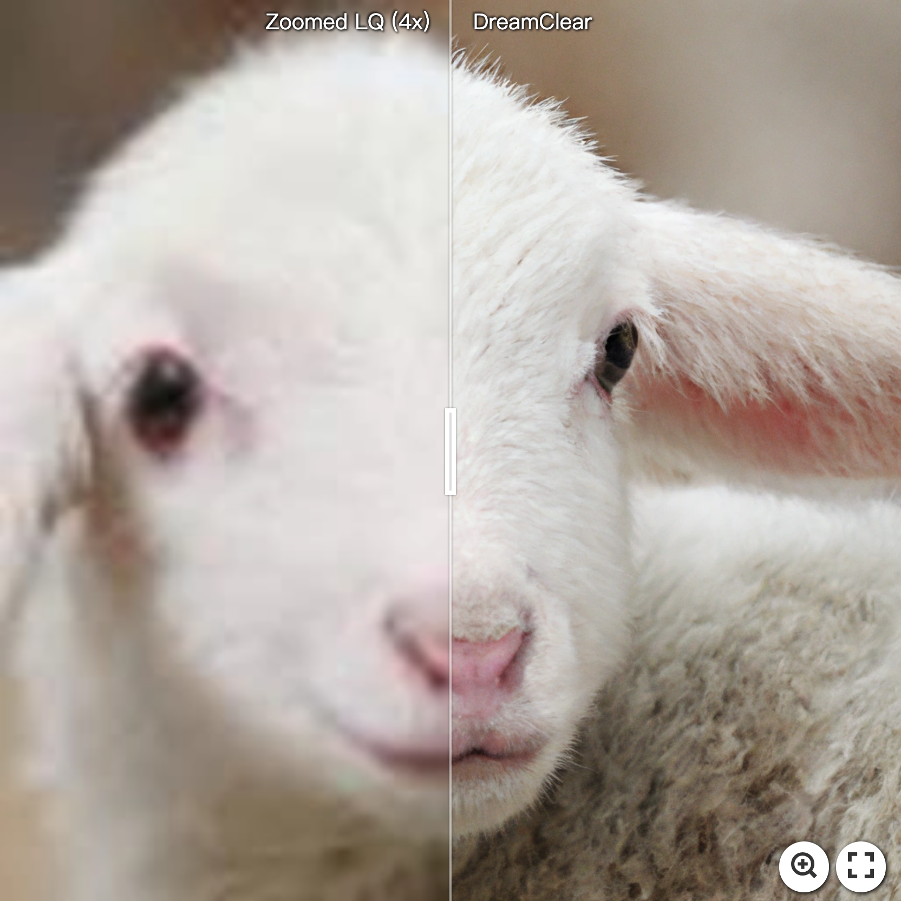
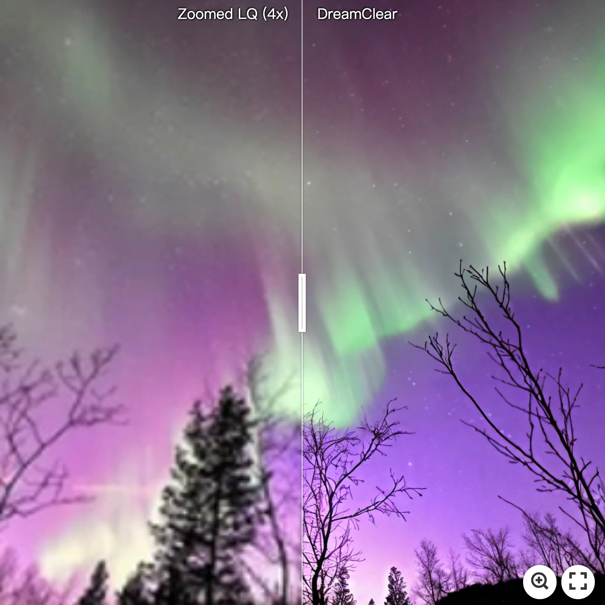
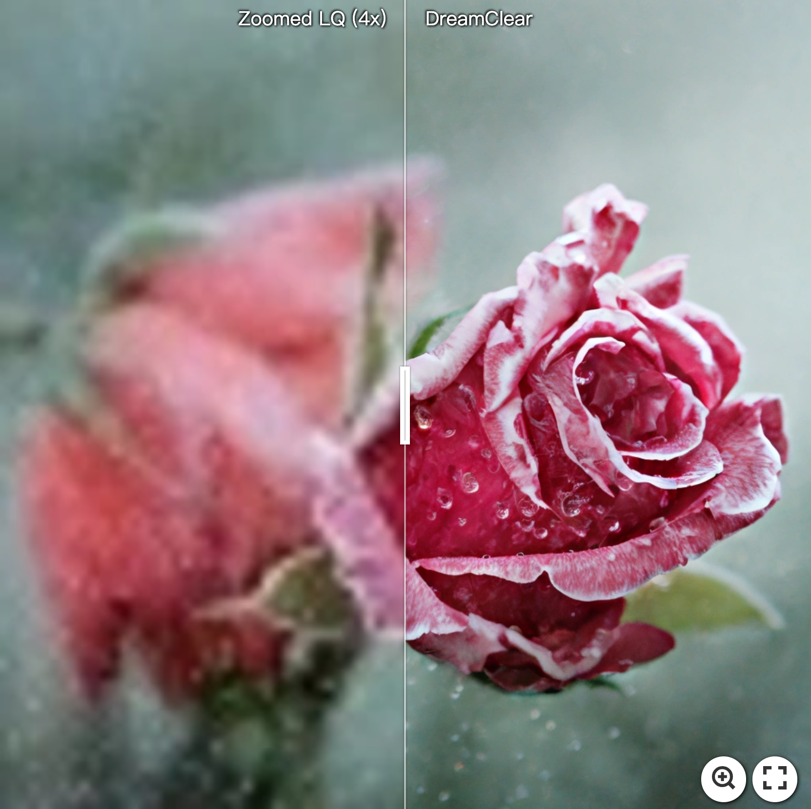

<div align="center">

<div class="logo">
      
   </a>
</div>

<h1>DreamClear: High-Capacity Real-World Image Restoration with Privacy-Safe Dataset Curation</h1>

<div>
    <a href='https://scholar.google.com/citations?user=2Qp7Y5kAAAAJ' target='_blank'>Yuang Ai</a><sup>1,2</sup>&emsp;
    <a href='https://scholar.google.com/citations?user=Z2BTkNIAAAAJ' target='_blank'>Xiaoqiang Zhou</a><sup>1,4</sup>&emsp;
    <a href='https://scholar.google.com/citations?user=XMvLciUAAAAJ' target='_blank'>Huaibo Huang</a><sup>1,2</sup>&emsp;
    <a href='https://scholar.google.com/citations?user=5fHHi24AAAAJ' target='_blank'>Xiaotian Han</a><sup>3</sup>&emsp;
    <a href='https://scholar.google.com/citations?user=0F1u21sAAAAJ' target='_blank'>Zhengyu Chen</a><sup>3</sup>&emsp;
    <a href='https://scholar.google.com/citations?user=c5KJsIgAAAAJ' target='_blank'>Quanzeng You</a><sup>3</sup>&emsp;
    <a href='https://scholar.google.com/citations?user=iJlC5mMAAAAJ' target='_blank'>Hongxia Yang</a><sup>3</sup>
</div>
<div>
    <sup>1</sup>MAIS & NLPR, Institute of Automation, Chinese Academy of Sciences&emsp;<br>
    <sup>2</sup>School of Artificial Intelligence, University of Chinese Academy of Sciences&emsp;<br>
    <sup>3</sup>ByteDance, Inc <sup>4</sup>University of Science and Technology of China&emsp;
</div>
<div>
</div>
<div>
    <strong>NeurIPS 2024</strong>
</div>

<div>
    <h4 align="center">
        <a href="https://arxiv.org/abs/2410.18666" target='_blank'>
        
        </a>
        <a href="https://huggingface.co/shallowdream204/DreamClear/tree/main" target='_blank'>
        
        </a>
        
    </h4>
</div>

⭐ If DreamClear is helpful to your projects, please help star this repo. Thanks! 🤗


</div>

<be>


## 🔥 News
- **More convenient inference code&demo will be released in the coming days. Please stay tuned for updates, thanks!**
- **2024.10.25**: Release segmentation&detection code, pre-trained models.
- **2024.10.25**: Release `RealLQ250` benchmark, which contains 250 real-world LQ images. 
- **2024.10.25**: Release training&inference (256->1024) code, pre-trained models of DreamClear. 
- **2024.10.24**: This repo is created.

## 📸 Real-World IR Results
[](https://imgsli.com/MzExNTEx) [](https://imgsli.com/MzEwNTEx) [](https://imgsli.com/MzEwNDk2)
[](https://imgsli.com/MzEwNTA4) [](https://imgsli.com/MzEwNTEz) [](https://imgsli.com/MzEwNTMw)


## 🔧 Dependencies and Installation

1. Clone this repo and navigate to DreamClear folder

   ```bash
   git clone https://github.com/shallowdream204/DreamClear.git
   cd DreamClear
   ```

2. Create Conda Environment and Install Package

   ```bash
   conda create -n dreamclear python=3.9 -y
   conda activate dreamclear
   pip3 install -r requirements.txt
   ```
3. Download Pre-trained Models (All models can be downloaded at [Huggingface](https://huggingface.co/shallowdream204/DreamClear/tree/main) for convenience.)
      #### Base Model:
      * `PixArt-α-1024`: [PixArt-XL-2-1024-MS.pth](https://huggingface.co/PixArt-alpha/PixArt-alpha/blob/main/PixArt-XL-2-1024-MS.pth)
      * `VAE`: [sd-vae-ft-ema](https://huggingface.co/PixArt-alpha/PixArt-alpha/tree/main/sd-vae-ft-ema)
      * `T5 Text Encoder`: [t5-v1_1-xxl](https://huggingface.co/PixArt-alpha/PixArt-alpha/tree/main/t5-v1_1-xxl)
      * `SwinIR`: [general_swinir_v1.ckpt](https://huggingface.co/lxq007/DiffBIR/blob/main/general_swinir_v1.ckpt)
      #### Ours provided Model:
      * `DreamClear`: [DreamClear-1024.pth](https://huggingface.co/shallowdream204/DreamClear/blob/main/DreamClear-1024.pth)
      * `RMT for Segmentation`: [rmt_uper_s_2x.pth](https://huggingface.co/shallowdream204/DreamClear/blob/main/rmt_uper_s_2x.pth)
      * `RMT for Detection`: [rmt_maskrcnn_s_1x.pth](https://huggingface.co/shallowdream204/DreamClear/blob/main/rmt_maskrcnn_s_1x.pth)
      
## 🎰 Train
#### I - Prepare training data
Similar to [SeeSR](https://github.com/cswry/SeeSR/blob/main/README.md#step2-prepare-training-data), We pre-prepare HQ-LQ image pairs for the training of IR model. Run the following command to make paired data for training:

```shell
python3 tools/make_paired_data.py \
--gt_path gt_path1 gt_path2 ... \ 
--save_dir /path/to/save/folder/ \
--epoch 1 # number of epochs to generate paired data
```

After generating paired data, you can use MLLM (e.g., [LLaVA](https://github.com/haotian-liu/LLaVA)) to generate detailed text prompt for HQ images. Then you need to use T5 to extract text features in order to save training time. Run:

```shell
python3 tools/extract_t5_features.py \
--t5_ckpt /path/to/t5-v1_1-xxl \
--caption_folder /path/to/caption/folder \
--save_npz_folder /path/to/save/npz/folder
```

Finally, the directory structure for training datasets should look like
```
training_datasets_folder/
    └── gt
        └── 0000001.png # GT , (1024, 1024, 3)
        └── ...
    └── sr_bicubic
        └── 0000001.png # LQ + bicubic upsample, (1024, 1024, 3)
        └── ...
    └── caption
        └── 0000001.txt # Caption files (not used in training)
        └── ...
    └── npz
        └── 0000001.npz # T5 features
        └── ...
```
#### II - Training for DreamClear
Run the following command to train DreamClear with default settings:
```shell
python3 -m torch.distributed.launch --nproc_per_node=8 --nnodes=... --node_rank=... --master_addr=... --master_port=... \
    train_dreamclear.py configs/DreamClear/DreamClear_Train.py \
    --load_from /path/to/PixArt-XL-2-1024-MS.pth \
    --vae_pretrained /path/to/sd-vae-ft-ema \
    --swinir_pretrained /path/to/general_swinir_v1.ckpt \
    --val_image /path/to/RealLQ250/lq/val_image.png \
    --val_npz /path/to/RealLQ250/npz/val_image.npz \
    --work_dir experiments/train_dreamclear
```
Please modify the path of training datasets in `configs/DreamClear/DreamClear_Train.py`. You can also modify the training hyper-parameters (e.g., `lr`, `train_batch_size`, `gradient_accumulation_steps`) in this file, according to your own GPU machines.
## ⚡ Inference
We provide the `RealLQ250` benchmark, which can be downloaded from [Google Drive](https://drive.google.com/file/d/16uWuJOyGMw5fbXHGcl6GOmxYJb_Szrqe/view?usp=sharing).
#### Testing DreamClear for Image Restoration


Run the following command to restore LQ images from 256 to 1024:
```shell
python3 -m torch.distributed.launch --nproc_per_node 1 --master_port 1234 \
    test_1024.py configs/DreamClear/DreamClear_Test.py \
    --dreamclear_ckpt /path/to/DreamClear-1024.pth \
    --swinir_ckpt /path/to/general_swinir_v1.ckpt \
    --vae_ckpt /path/to/sd-vae-ft-ema \
    --lre --cfg_scale 4.5 --color_align wavelet \
    --image_path /path/to/RealLQ250/lq \
    --npz_path /path/to/RealLQ250/npz \
    --save_dir validation
```
#### Evaluation on high-level benchmarks

Testing instructions for [segmentation](segmentation/README.md) and [detection](detection/README.md) can be found in their respective folders.

## 🪪 License

The provided code and pre-trained weights are licensed under the [Apache 2.0 license](LICENSE).

## 🤗 Acknowledgement

This code is based on [PixArt-α](https://github.com/PixArt-alpha/PixArt-alpha), [BasicSR](https://github.com/XPixelGroup/BasicSR) and [RMT](https://github.com/qhfan/RMT). Some code are brought from [SeeSR](https://github.com/cswry/SeeSR), [StableSR](https://github.com/IceClear/StableSR), [DiffBIR](https://github.com/XPixelGroup/DiffBIR) and [LLaVA](https://github.com/haotian-liu/LLaVA). We thank the authors for their awesome work.

## 📧 Contact
If you have any questions, please feel free to reach me out at shallowdream555@gmail.com. 

## 📖 Citation
If you find our work useful for your research, please consider citing our paper:
```
@article{ai2024dreamclear,
      title={DreamClear: High-Capacity Real-World Image Restoration with Privacy-Safe Dataset Curation},
      author={Ai, Yuang and Zhou, Xiaoqiang and Huang, Huaibo and Han, Xiaotian and Chen, Zhengyu and You, Quanzeng and Yang, Hongxia},
      journal={Advances in Neural Information Processing Systems},
      year={2024}
}
```
